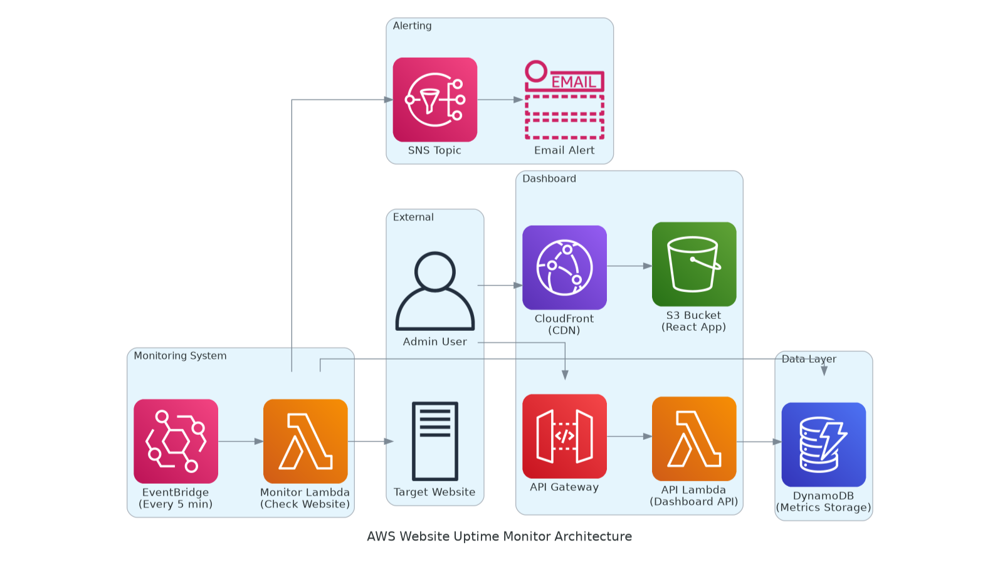

# 🔄 EC2 Backup Automation

> **Automated, serverless EC2 backups using AWS Lambda, EventBridge, and Terraform**

[](https://terraform.io)
[](https://aws.amazon.com)
[](https://python.org)

This project creates a fully-managed backup system that snapshots tagged EC2 instances nightly, retains snapshots for 7 days, and stores logs in S3 — **zero manual intervention required**.

## ✨ Features

- 🌙 **Nightly automatic backups** of EC2 instances tagged `Backup=true`
- 🗓️ **7-day retention policy** with automatic cleanup
- ⚡ **Fully serverless** and AWS-native (Lambda + EventBridge)
- 📊 **Centralized logging** stored in S3 bucket
- 🧩 **Modular Terraform** structure for easy extension
- 🔒 **Least-privilege IAM** roles and policies

## 🏗️ Architecture



The backup system follows a simple, event-driven architecture:

| Component | Purpose |
|-----------|---------|
| **EventBridge Rule** | Triggers Lambda on daily cron schedule |
| **Lambda Function** | Executes snapshot creation and cleanup logic |
| **S3 Bucket** | Stores Lambda execution logs and artifacts |
| **EC2 Instances** | Only instances tagged `Backup=true` are processed |

## 🚀 Quick Start

### Prerequisites

- AWS CLI configured with appropriate permissions
- Terraform >= 1.0
- Python 3.12 (for Lambda function)

### 1️⃣ Clone & Setup

```bash
git clone <repository-url>
cd ec2-backup-iac
```

### 2️⃣ Build Lambda Package

```bash
cd lambda
./build.sh
cd ..
```

### 3️⃣ Configure Variables

Create `terraform.tfvars`:

```hcl
region       = "us-east-1"
environment  = "production"
project_name = "ec2-backup"
```

### 4️⃣ Deploy Infrastructure

```bash
terraform init
terraform plan
terraform apply
```

**What gets created:**
- ✅ IAM Role with least-privilege permissions
- ✅ S3 Bucket for logs and artifacts
- ✅ Lambda Function (Python 3.12)
- ✅ EventBridge Rule (daily cron trigger)
- ✅ Example EC2 instances with backup tags

## 📋 Usage

### Tag EC2 Instances for Backup

Simply tag any EC2 instance you want to backup:

```
Key: Backup
Value: true
```

### Backup Process

1. **Daily Trigger**: EventBridge triggers Lambda at midnight UTC
2. **Instance Discovery**: Lambda finds all instances tagged `Backup=true`
3. **Snapshot Creation**: Creates EBS snapshots for each instance
4. **Tagging**: Tags snapshots with metadata (instance ID, date, retention)
5. **Cleanup**: Removes snapshots older than 7 days
6. **Logging**: Writes execution logs to S3

### Monitor Backups

- **CloudWatch Logs**: Lambda execution logs
- **S3 Bucket**: Detailed backup reports
- **EC2 Console**: View created snapshots

## 🛠️ Configuration
### Terraform Variables

| Variable | Type | Default | Description |
|----------|------|---------|-------------|
| `aws_region` | string | `us-west-2` | AWS region |
| `environment` | string | `dev` | Environment name |
| `backup_schedule` | string | `cron(0 2 * * ? *)` | EventBridge cron expression |
| `retention_days` | number | `7` | Snapshot retention period |

## 📦 Terraform Modules

This project uses official AWS Terraform modules:

- **[terraform-aws-modules/s3-bucket/aws](https://registry.terraform.io/modules/terraform-aws-modules/s3-bucket/aws)** - S3 bucket with security defaults
- **[terraform-aws-modules/lambda/aws](https://registry.terraform.io/modules/terraform-aws-modules/lambda/aws)** - Lambda function with IAM role
- **[terraform-aws-modules/eventbridge/aws](https://registry.terraform.io/modules/terraform-aws-modules/eventbridge/aws)** - EventBridge rules and targets
- **[terraform-aws-modules/ec2-instance/aws](https://registry.terraform.io/modules/terraform-aws-modules/ec2-instance/aws)** - Example EC2 instances

## 🔧 Troubleshooting

### Common Issues

**Lambda not triggering?**
- Check EventBridge rule is enabled
- Verify `aws_lambda_permission` resource exists
- Review CloudWatch Logs for errors

**Snapshots not created?**
- Ensure EC2 instances have `Backup=true` tag
- Check Lambda IAM permissions
- Verify instances are in the same region

**Permission errors?**
- Review IAM policy in `templates/lambda_policy.json`
- Ensure AWS credentials have sufficient permissions

### Debug Mode

Enable debug logging:

```bash
terraform apply -var="log_level=DEBUG"
```

## 🧹 Cleanup

Remove all resources:

```bash
terraform destroy
```

**⚠️ Warning**: This will delete all snapshots created by this system.

## 🚀 Future Improvements
- Setup lifecycle policy in Log S3 Bucket for cost savings
- Send SNS notifications for failed snapshots
- Support multi-region backups
- Support multiple backup schedules

## 🤝 Contributing

1. Fork the repository
2. Create a feature branch
3. Make your changes
4. Add tests
5. Submit a pull request

## 📄 License

This project is licensed under the MIT License - see the [LICENSE](LICENSE) file for details.

## 🆘 Support
- 🐛 **Issues**: Report bugs via GitHub Issues
- 💡 **Feature Requests**: Suggest new features
- 💬 **Discussions**: Lets connect on [Linkedin](https://www.linkedin.com/in/hasan-ashab/)


---

**Made with ❤️ and ☕ by Hasan Ashab**
