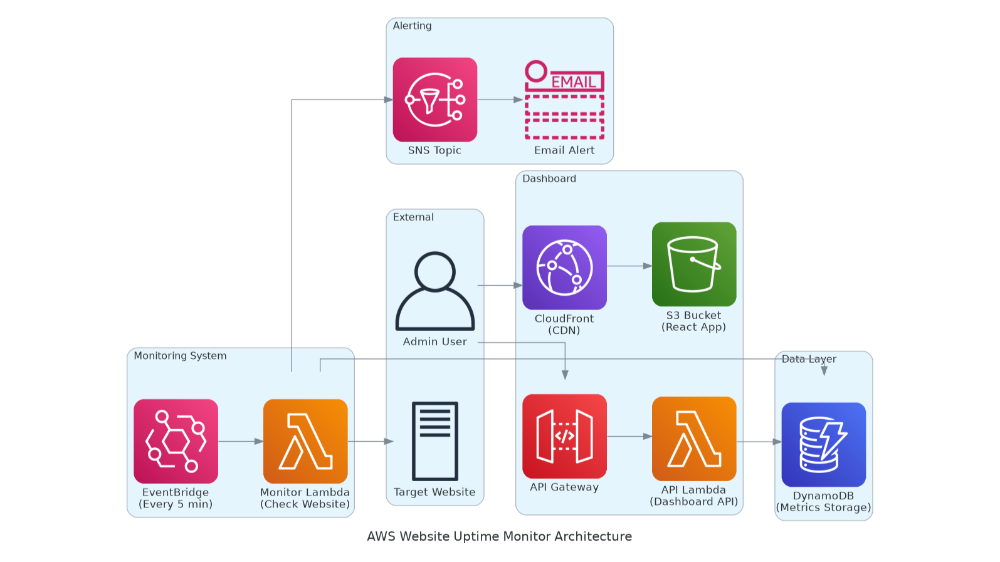

# Build a Real-Time Website Uptime Monitor with AWS Lambda, EventBridge and Terraform

*Stop wondering if your website is down.*
Here's how to build a **complete uptime monitoring system** with real-time dashboard using AWS _Lambda_, _DynamoDB_, _React_, and _Terraform_ — get instant alerts when your site goes down.

## Jump To:
- [Picture This](#picture-this)
- [Why This Solution Works](#why-this-solution-works)
- [The Architecture](#the-architecture-simple-yet-powerful)
- [Requirements](#what-youll-need)
- [Step 1: Project Structure](#step-1-project-structure)
- [Step 2: Monitoring Lambda](#step-2-the-monitoring-lambda-the-watchdog)
- [Step 3: Dashboard API](#step-3-dashboard-api-serving-the-data)
- [Step 4: React Dashboard](#step-4-react-dashboard-beautiful-real-time-ui)
- [Step 5: Infrastructure](#step-5-terraform-infrastructure)
- [Step 6: Deployment](#step-6-deployment)
- [Step 7: Testing](#step-7-test-your-monitoring-system)
- [Monitoring and Alerts](#monitoring-and-alerts)
- [Troubleshooting](#troubleshooting-common-issues)
- [Contact](#contact)

## Picture this:
Your website goes down at 2 AM. Your customers can't access your service, but you're peacefully sleeping, completely unaware. By morning, you've lost customers, revenue, and trust. Sound familiar?

Today, I'll show you how to build a comprehensive website monitoring system that never sleeps. By the end of this guide, you'll have:

- Real-time uptime monitoring with customizable checks
- Beautiful dashboard showing response times and availability
- Instant email alerts when your site goes down
- Historical data and monthly uptime reports
- All running serverlessly for pennies per month

The best part? It takes about 30 minutes to set up and monitors your site 24/7.

## Why This Solution Works

Before diving into the code, let's understand why this serverless approach beats traditional monitoring services:

* **Cost-Effective**: Monitor multiple websites for under $5/month. No expensive SaaS subscriptions.
* **Customizable**: Full control over what gets monitored and how alerts are sent.
* **Real-Time**: Dashboard updates every minute with live data and beautiful charts.
* **Scalable**: Monitor 1 website or 100 - the system scales automatically.
* **Reliable**: Built on AWS managed services with 99.99% uptime SLA.

## The Architecture (Simple Yet Powerful)

Our monitoring system has six main components working together:

1. **EventBridge**: Triggers uptime checks every 5 minutes (or your preferred interval)
2. **Monitoring Lambda**: Performs HTTP checks and validates responses
3. **DynamoDB**: Stores all monitoring data and metrics
4. **API Lambda**: Serves dashboard data through REST endpoints
5. **React Dashboard**: Beautiful real-time UI with charts and metrics
6. **SNS**: Sends email alerts for downtime events



Here's the flow:

```
EventBridge (Every 5min) → Monitor Lambda → Check Website → Store Results → DynamoDB
                                                                              ↓
React Dashboard ← API Lambda ← DynamoDB ← SNS Alerts (if down)
```

Clean, simple, and bulletproof.

## What You'll Need

Before we start, make sure you have:

- AWS CLI configured with appropriate permissions
- Terraform installed (version 1.0 or later)
- Node.js 22+ and npm
- Basic familiarity with React and AWS services
- About 30 minutes of your time

Don't worry if you're new to some of these - I'll guide you through everything.

## Step 1: Project Structure

Let's organize our project for maximum clarity and reusability:

```
website-uptime-monitor/
├── infra/                          # Terraform infrastructure
│   ├── main.tf                     # Main configuration
│   ├── variables.tf                # Input variables
│   ├── envs/
│   │   └── prod.tfvars            # Production config
│   └── modules/
│       ├── uptime_monitor/         # Monitoring infrastructure
│       └── dashboard/              # Dashboard infrastructure
├── dashboard/
│   ├── backend/                    # Lambda API functions
│   │   └── functions/
│   │       ├── get.mjs            # Metrics endpoint
│   │       ├── list.mjs           # All data endpoint
│   │       └── create.mjs         # Recent pings endpoint
│   └── frontend/                   # React dashboard
│       ├── src/
│       │   ├── App.js             # Main dashboard component
│       │   └── index.css          # Styling
│       └── package.json
└── .github/workflows/              # CI/CD pipelines
    ├── backend-cicd.yaml
    └── frontend-cicd.yaml
```

You can either clone the complete project or create the structure manually:

**Option 1: Clone the complete project (recommended):**
```bash
git clone <your-repo-url>
cd website-uptime-monitor
```

**Option 2: Create the structure manually:**
```bash
mkdir website-uptime-monitor
cd website-uptime-monitor
mkdir -p infra/{modules/{uptime_monitor,dashboard},envs}
mkdir -p dashboard/{backend/functions,frontend/src}
mkdir -p .github/workflows
```

## Step 2: The Monitoring Lambda (The Watchdog)

The monitoring Lambda is the heart of our system. It performs HTTP checks, validates responses, and stores results.

Here's what our monitoring function does:

```python
def lambda_handler(event, context):
    # 1. Fetch the target website URL from environment
    # 2. Perform HTTP request with timeout
    # 3. Validate status code and response body
    # 4. Measure response time
    # 5. Store results in DynamoDB
    # 6. Send SNS alert if website is down
```

The function checks for:
- **HTTP Status Code**: Ensures it matches expected value (usually 200)
- **Response Body**: Validates that specific text is present
- **Response Time**: Measures and stores response time in milliseconds
- **Connection Issues**: Catches timeouts and network errors

_Full monitoring Lambda code available in the repository_

## Step 3: Dashboard API (Serving the Data)

Our dashboard needs three API endpoints to display comprehensive monitoring data:

### Metrics Endpoint (`get.mjs`)
```javascript
// GET /metrics - Returns monthly aggregated data
export const handler = async (event) => {
  const metrics = {
    uptime: 99.5,                    // Percentage uptime this month
    invalidStatusCount: 2,           // Number of failed status checks
    avgResponseTime: 245,            // Average response time in ms
    totalChecks: 1440,              // Total checks performed
    successfulChecks: 1438,          // Successful checks
    failedChecks: 2,                 // Failed checks
    lastUpdated: new Date().toISOString()
  };

  return {
    statusCode: 200,
    headers: corsHeaders,
    body: JSON.stringify(metrics)
  };
};
```

### Recent Pings Endpoint (`create.mjs`)
```javascript
// GET /recent-pings - Returns last 30 minutes of data
export const handler = async (event) => {
  // Filter DynamoDB data for last 30 minutes
  // Return detailed ping results with timestamps
};
```

### All Data Endpoint (`list.mjs`)
```javascript
// GET /uptime-data - Returns all monitoring data
export const handler = async (event) => {
  // Scan entire DynamoDB table
  // Return all historical data
};
```

These endpoints power our dashboard with real-time data and historical trends.

## Step 4: React Dashboard (Beautiful Real-Time UI)

Our React dashboard provides a beautiful, responsive interface for monitoring your website:

### Key Features:
- **Monthly Metrics Cards**: Uptime percentage, failed checks, average response time
- **Real-Time Chart**: Response time visualization for the last 30 minutes
- **Recent Pings Table**: Detailed list of recent monitoring attempts
- **Auto-Refresh**: Updates every 60 seconds automatically
- **Responsive Design**: Works perfectly on desktop, tablet, and mobile

### Main Dashboard Component (`App.js`):
```javascript
function App() {
  const [metrics, setMetrics] = useState(null);
  const [recentPings, setRecentPings] = useState([]);
  const [chartData, setChartData] = useState([]);

  // Auto-refresh every 60 seconds
  useEffect(() => {
    fetchData();
    const interval = setInterval(fetchData, 60000);
    return () => clearInterval(interval);
  }, []);

  const fetchData = async () => {
    // Fetch from our API endpoints
    // Update state with fresh data
  };

  return (
    <div className="dashboard">
      <MetricsCards metrics={metrics} />
      <ResponseTimeChart data={chartData} />
      <RecentPingsTable pings={recentPings} />
    </div>
  );
}
```

The dashboard uses:
- **Recharts** for beautiful, responsive charts
- **Framer Motion** for smooth animations
- **React Icons** for consistent iconography
- **Custom CSS** with modern gradients and glassmorphism effects

## Step 5: Terraform Infrastructure

Now let's tie everything together with Terraform. Our infrastructure is modular and reusable:

### Main Configuration (`infra/main.tf`):
```hcl
# DynamoDB table for storing monitoring data
module "dynamodb_table" {
  source  = "terraform-aws-modules/dynamodb-table/aws"
  version = "5.1.0"

  name         = "${local.project_name}-dynamodb-${var.environment}"
  hash_key     = "id"
  billing_mode = var.db_billing_mode

  attributes = [
    {
      name = "id"
      type = "S"
    }
  ]
}

# Uptime monitoring system
module "uptime_monitor" {
  source = "./modules/uptime_monitor"

  environment = var.environment
  name_prefix = local.project_name

  website_url         = var.target_website_url
  ping_schedule       = var.uptime_ping_schedule
  assertions          = var.uptime_assertions
  subscriber_email    = var.uptime_alert_subscriber_email
  dynamodb_table_name = module.dynamodb_table.dynamodb_table_id
}

# Dashboard (API + Frontend)
module "dashboard" {
  source = "./modules/dashboard"

  environment = var.environment
  name_prefix = local.project_name

  backend_src_root    = "${path.root}/../dashboard/backend"
  dynamodb_table_name = module.dynamodb_table.dynamodb_table_id
}
```

### Configuration Variables (`infra/variables.tf`):
```hcl
variable "target_website_url" {
  description = "URL of the website to monitor"
  type        = string
  default     = "https://example.com/"
}

variable "uptime_ping_schedule" {
  description = "EventBridge cron expression for monitoring frequency"
  type        = string
  default     = "cron(*/5 * * * ? *)"  # Every 5 minutes
}

variable "uptime_assertions" {
  description = "Monitoring assertions"
  default = {
    status_code          = 200
    body_includes        = "Welcome"
    max_response_time_ms = 1000
  }
}

variable "uptime_alert_subscriber_email" {
  description = "Email address for downtime alerts"
  type        = string
}
```

### Environment Configuration (`infra/envs/prod.tfvars`):
```hcl
environment                   = "prod"
aws_region                   = "us-west-2"
target_website_url           = "https://your-website.com"
uptime_alert_subscriber_email = "alerts@your-domain.com"
uptime_ping_schedule         = "cron(*/5 * * * ? *)"

uptime_assertions = {
  status_code          = 200
  body_includes        = "Your Site Title"
  max_response_time_ms = 2000
}
```

## Step 6: Deployment

Now let's deploy our complete monitoring system:

### Deploy Infrastructure:
```bash
cd infra
terraform init
terraform workspace new prod
terraform plan -var-file=envs/prod.tfvars
terraform apply -var-file=envs/prod.tfvars
```

### Deploy Frontend:
```bash
cd dashboard/frontend
npm install
npm run build

# Upload to S3 bucket (created by Terraform)
aws s3 sync build/ s3://your-dashboard-bucket --delete
```

Terraform will create:
- ✅ DynamoDB table for monitoring data
- ✅ Lambda functions for monitoring and API
- ✅ EventBridge rule for scheduled checks
- ✅ SNS topic for email alerts
- ✅ S3 bucket and CloudFront for dashboard hosting
- ✅ API Gateway for dashboard endpoints

## Step 7: Test Your Monitoring System

Don't wait for your site to go down to test the system! Here's how to verify everything works:

### Trigger Manual Check:
```bash
aws lambda invoke \
  --function-name your-monitor-function \
  --payload '{}' \
  response.json
```

### Check Monitoring Logs:
1. Go to CloudWatch → Log groups
2. Find `/aws/lambda/your-monitor-function`
3. Check the latest log stream for monitoring results

### Verify Data Storage:
1. Go to DynamoDB → Tables → your-monitoring-table
2. Click "Explore table items"
3. Verify monitoring records are being created

### Test Dashboard:
1. Get your dashboard URL from Terraform output:
   ```bash
   terraform output dashboard_url
   ```
2. Open the URL in your browser
3. Verify you see:
   - Monthly metrics cards
   - Response time chart
   - Recent pings table
   - Auto-refresh functionality

### Test Alerts:
Temporarily change your website URL to a non-existent domain:
```bash
terraform apply -var="target_website_url=https://non-existent-site.com" -var-file=envs/prod.tfvars
```

You should receive an email alert within 5 minutes.

## Monitoring and Alerts

Your monitoring system is now active! Here's how to keep it running smoothly:

### Email Alert Configuration

The system automatically sends alerts for:
- **Website Down**: HTTP errors, timeouts, connection failures
- **Slow Response**: Response time exceeds your threshold
- **Content Changes**: Expected text not found in response body
- **Status Code Issues**: Unexpected HTTP status codes

### Dashboard Features

Your dashboard provides:
- **Real-Time Metrics**: Current month uptime percentage
- **Response Time Trends**: Visual chart of performance over time
- **Failure Analysis**: Count and details of failed checks
- **Historical Data**: Complete monitoring history

### Cost Monitoring

Monitor your AWS costs:
```bash
# Check monthly costs for monitoring services
aws ce get-cost-and-usage \
  --time-period Start=2025-01-01,End=2025-02-01 \
  --granularity MONTHLY \
  --metrics BlendedCost \
  --group-by Type=DIMENSION,Key=SERVICE
```

Expected monthly costs:
- **Lambda**: $0.20 (for ~8,640 invocations/month)
- **DynamoDB**: $1.25 (for ~250,000 read/write units)
- **CloudFront**: $0.50 (for dashboard hosting)
- **SNS**: $0.50 (for email alerts)
- **Total**: ~$2.45/month

## Troubleshooting Common Issues

### Lambda Timeout Errors:
- Increase timeout in Terraform configuration
- Check if target website is responding slowly
- Verify network connectivity from Lambda

### Dashboard Not Loading:
- Check CloudFront distribution status
- Verify S3 bucket has correct files
- Check API Gateway endpoints are working

### No Email Alerts:
- Confirm SNS subscription in AWS console
- Check spam folder for confirmation email
- Verify email address in Terraform variables

### Missing Data in Dashboard:
- Check DynamoDB table has monitoring records
- Verify Lambda function is being triggered by EventBridge
- Check API Lambda functions have correct DynamoDB permissions

### High Response Times:
- Check if your website is actually slow
- Verify Lambda is in same region as your website
- Consider adjusting response time thresholds

## Advanced Features

Once your basic monitoring is working, consider these enhancements:

### Multi-Website Monitoring:
```hcl
# Monitor multiple websites
variable "websites" {
  default = {
    "main-site" = {
      url = "https://your-main-site.com"
      expected_text = "Welcome"
    }
    "api-endpoint" = {
      url = "https://api.your-site.com/health"
      expected_text = "OK"
    }
  }
}
```

### Slack Integration:
Replace SNS email with Slack webhooks for team notifications.

### Custom Metrics:
Add CloudWatch custom metrics for advanced monitoring and alerting.

### Multi-Region Monitoring:
Deploy monitoring Lambda in multiple regions for global perspective.

## What's Next?

You now have a production-ready website monitoring system! Here are some ideas for further enhancement:

- **Mobile App**: Build a React Native app for monitoring on-the-go
- **Advanced Analytics**: Add trend analysis and predictive alerts
- **Integration APIs**: Connect with PagerDuty, Slack, or Microsoft Teams
- **SLA Reporting**: Generate monthly uptime reports for stakeholders
- **Performance Budgets**: Set and track performance goals over time

## Wrapping Up

Building a comprehensive website monitoring system doesn't have to break the bank or require complex infrastructure. With AWS serverless services, React, and Terraform, you can create a robust monitoring solution that:

- **Monitors 24/7**: Never miss downtime again
- **Costs Under $5/month**: Fraction of commercial monitoring services
- **Provides Beautiful Dashboard**: Real-time insights with professional UI
- **Scales Automatically**: Handle traffic spikes without configuration
- **Sends Instant Alerts**: Know about issues before your customers do

**Key Benefits:**
- Set up once, monitor forever
- Complete visibility into website performance
- Professional-grade monitoring at startup prices
- Full control over monitoring logic and alerts
- Beautiful dashboard your team will actually use

**Remember**: You can't fix what you can't see.

Your website is your business's front door. Make sure you know when it's closed, how fast it opens, and whether visitors can find what they're looking for.

Now go forth and monitor with confidence!

---

## Contact

*Questions about this monitoring setup? Found an issue with the implementation? Want to share your monitoring success story?*

Reach out:
* **Website**: [hasan-ashab](https://hasan-ashab.vercel.app/)
* **LinkedIn**: [linkedin.com/in/hasan-ashab](https://linkedin.com/in/hasan-ashab/)
* **GitHub**: Check out the complete code repository

*Happy monitoring! 🚀*
